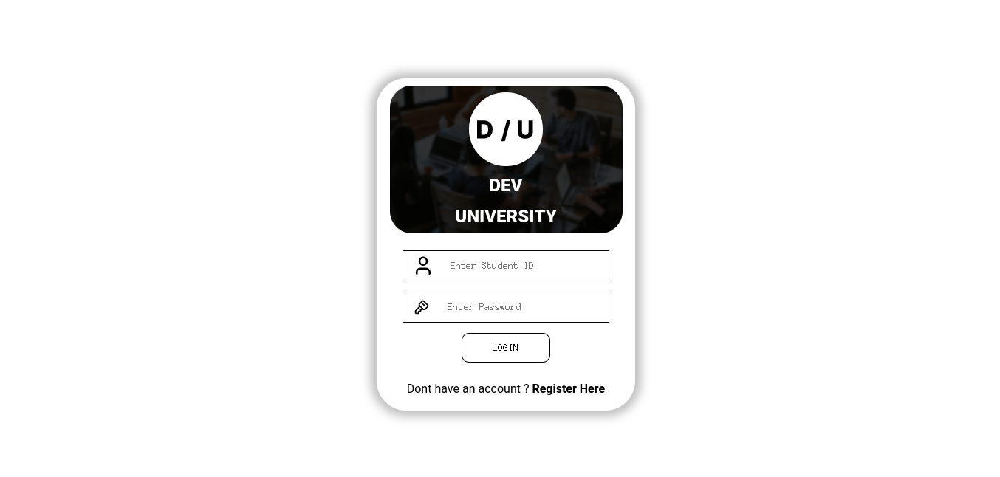
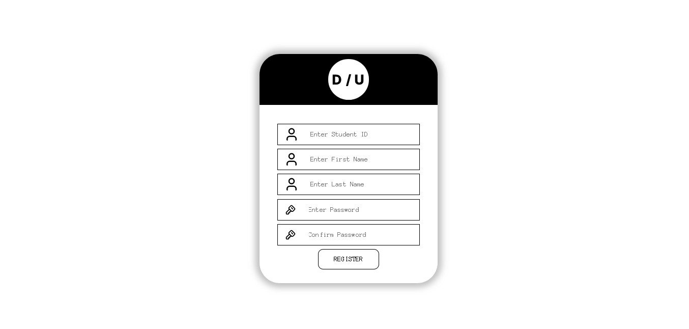
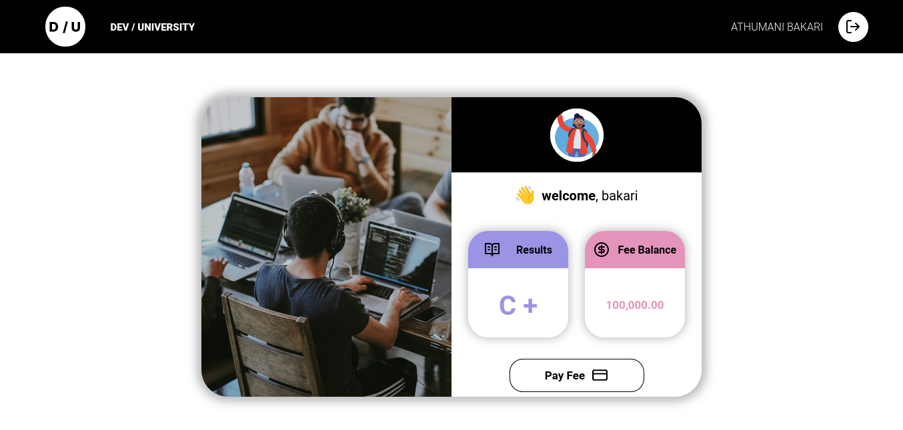
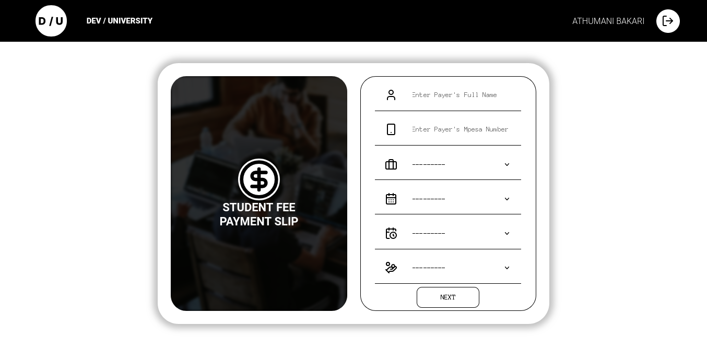
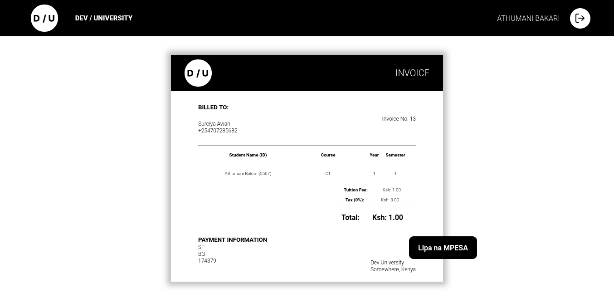
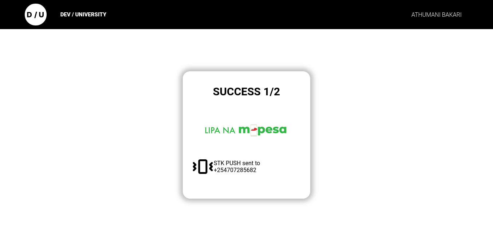
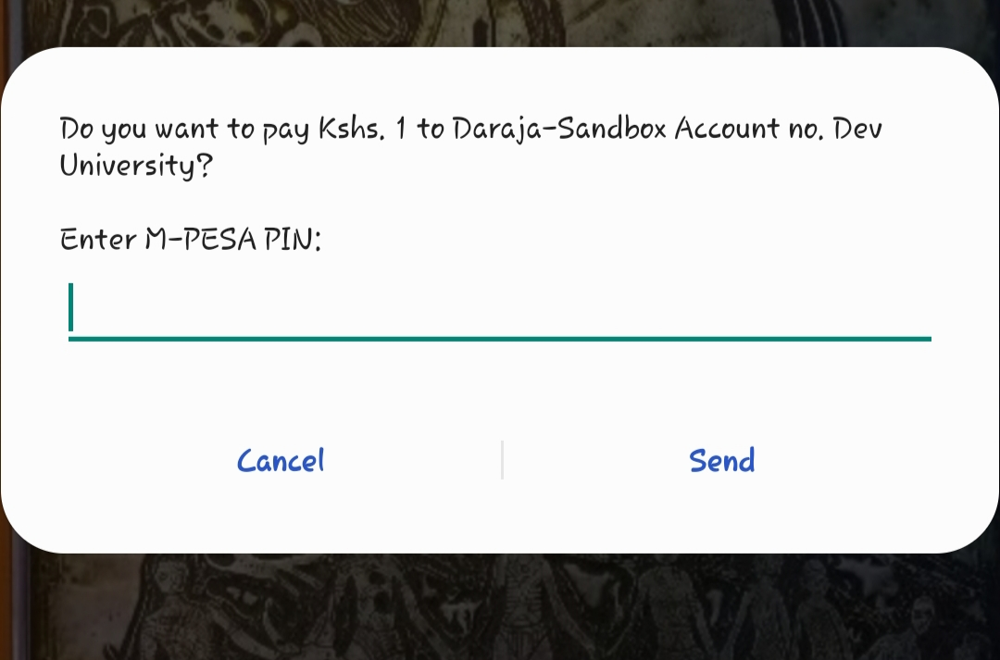

# :school: Student Fee Payment Portal
> :bulb: Implemented with safaricom daraja API and Braintree
## 💬 Description
> This is a project that shows the concept of payment integration with safaricom daraja API that allows STK push to a student to complete payments of fees and also braintree to allow credit card payments.
> The projects allows a user (student)  to login or register an account and access their dashboard. From this dashboard they can access payment links for their fees covering various fee structures on modules offered by the university.
## 📜 More

> ## Ngrok
> This is a free service that allows to shares our django application running on the local server allowing it to communicate with the safaricom daraja API 
> 
> ## Daraja API
> A service provided in the safaricom dev portal to allow mpesa STK push notifications from a merchant (the university) to the client (student)  for payment of fees. The user triggers an STK push from the django app and receives a prompt on their phone to complete payment in an easier flow.

> ## Braintree
> A payment gateway that allows processing payments for credit cards, apple pay, paypal etc in your project.


> 
>## Mwanafunzi
> Our created django app that provides a UI for the user (student)  to allow services such as authentication and authorization, payment of fees with MPESA.
  1. Login setup
     > A student is prompted to enter their student ID and password for authorization
     <details>
      <summary>Login screenshot</summary>
      
      
     </details>
  1. Register setup
     > A student fills up a form to create a new account.
     <details>
      <summary>Register screenshot</summary>
      
      
     </details>
  1. Dashboard setup
     > Student own dashboard to access payment links
     <details>
      <summary>Dashboard screenshot</summary>
      
      
     </details>
  1. Payment Slip
     > A user fills out a payment slip to add payment details
     <details>
      <summary>Payment Slip Screenshot</summary>
      
      
     </details>
1. Invoice
     > The app provides an invoice with the details of payment and total fee according to the fee structure of the university.
     <details>
      <summary>Invoice Screenshot</summary>
      
      
     </details>
  1. MPESA confirmation
     > When user triggers the payment button to trigger an STK push the app shows a confirmation popup on  a successful request
     <details>
      <summary>Success Screenshot</summary>
      
      
     </details>
 1. STK push 
     > The student receives a STK push notification on their phone
     <details>
      <summary>STK screenshot</summary>
      
      
     </details>

>## Docker
> We use docker to run the ngrok image as a container to allow sharing of our django application (mwanafunzi)  
> 
>## Figma
> Tool I used to design the UI used. Here is a link to the design :  
> 
## 🔧 Code Setup
   1. Clone the repo
        ```bash
            git clone https://github.com/mwanafunzi.git

        ```
   1. Setup ngrok with docker
        ```bash
            docker run --net=host -it -e NGROK_AUTHTOKEN=<YOUR_NGROK_TOKEN> ngrok/ngrok:latest http 8000

        ```
1. Create an app in safaricom daraja API dev portal.
3. Edit the NGROK_URL in settings.py of your project with your new ngrok url gotten when the container is running.
## 💻🏃‍♂️ Running Code Snippet
   1. Move into project
        ```bash
            cd mwanafunzi/mwanafunzi

        ```
   1. Run docker services
        ```bash
            python manage.py runserver

        ```

